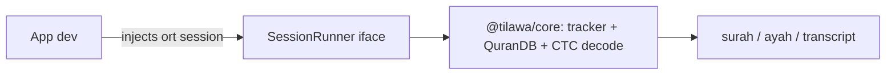

# Tilawa

Offline Quran verse recognition — give it 16kHz audio, get `surah:ayah`. Fully on-device (web / node / React Native).

This repo ships two things:

- **`@tilawa/core`** (`packages/core/`) — the SDK. Pure TypeScript: CTC decode + `QuranDB` verse matching + streaming tracker. Zero native deps; the app dev injects an ONNX `SessionRunner`.
- **Web demo** (`web/`) — live browser recitation demo that consumes `@tilawa/core` as its regression guard.

The Python research/training/benchmark harness lives under `lab/` and has its own `lab/AGENTS.md`. Model weights are proven out there, then their logic graduates into the SDK.

## Layout

```
packages/core/     # @tilawa/core SDK (the shipped product)
  src/
    index.ts             # createTilawaSession(runner, assets) + TilawaSession, TilawaAssets
    session.ts           # SessionRunner injection seam (type-only, no onnxruntime)
    quran-db.ts          # QuranDB — verse matching (bestJoint03Match)
    tracker.ts           # RecitationTracker — streaming verse detection
    text-ctc-decode.ts   # TextCTCDecoder — logprobs -> text
    quran-text-adapter.ts# adaptQuranTextData / validateCtcTokenRoundTrip
    ctc-rescore.ts, levenshtein.ts, normalizer.ts, types.ts  # pure helpers
  test/                  # deterministic vitest (decode+match, no ONNX)
web/                     # live browser demo (Vite + worker), consumes @tilawa/core
  frontend/src/worker/session.ts  # the web SessionRunner (onnxruntime-web)
lab/                     # Python research/training/benchmark harness — see lab/AGENTS.md
README.md, Dockerfile, LICENSE
```

## SDK architecture

The working pipeline cleanly splits into:

- **Pure-TS core** — `quran-db`, `tracker`, `text-ctc-decode`, `quran-text-adapter`, `ctc-rescore`, `levenshtein`, `normalizer`, `types`. Zero ONNX imports.
- **ONNX boundary** — a single `SessionRunner` interface the app dev injects. Contract: input `audio_signal [1,N]` float32 + `length`, output `[1,T,vocab]` logprobs. Preprocessing is baked into the ONNX graph.

So the SDK is one package, zero native deps, and works in web/node/RN by swapping which `onnxruntime` build the dev wires into their `SessionRunner`.



### Public surface (`@tilawa/core`)

- `createTilawaSession(runner, assets, options?) -> TilawaSession`
- `TilawaSession`: `transcribe(audio)`, `transcribeRaw(audio)`, `feed(chunk)`, `reset()`, `setConfig()`, `getConfig()`, `db`, `decoder`
- `SessionRunner` (inject), `SessionOutput`, `TilawaAssets`, `TilawaPrediction`
- Config + types: `StreamingConfig`, presets, `normalizeStreamingConfig`, `QuranVerse`, `SurahData`, `QuranDB`, `TextCTCDecoder`, `RecitationTracker`

`assets` = `{ vocab, quranCtcTokens, quran, blankId? }` — JSON blobs the dev loads. Model bytes go into their `SessionRunner`, not into `assets`.

## Build & test the SDK

```bash
cd packages/core
npm install
npx tsc -p tsconfig.json   # typecheck / build
npx vitest run             # deterministic decode+match tests (no ONNX)
```

Both must be green before merge.

## Run the web demo

The demo is the SDK's regression guard: if it still recognizes recitation against `@tilawa/core`, the SDK is correct.

```bash
cd web/frontend
npm install
npm run dev                # vite dev server
npm run build              # tsc && vite build
npm run build:server && npm run start   # bundled node server (dist-server/index.mjs)
```

`Dockerfile` at the root builds and serves this demo.

### Streaming validation

```bash
cd web/frontend
npm run test:streaming            # tsx test/validate-streaming.ts
npm run test:streaming:matrix     # config matrix
npm run test:streaming:diagnostics
```

## Making changes

- **SDK core change** (decode / matcher / tracker) → edit `packages/core/src/`. Add/extend a `packages/core/test/*.test.ts` that deterministically exercises it without ONNX. `npx vitest run` stays green.
- **Demo change** → edit `web/frontend/src/`. Verify `npm run build` typechecks and the demo still recognizes recitation.
- **New model / matching strategy / training** → that's lab work. See `lab/AGENTS.md`. Nothing in `lab/` may import from `packages/` or `web/`, and vice versa.

## Worktree + merge discipline

Develop every change in a worktree under `./.worktrees/`, then merge back with `--no-ff`.

```bash
git worktree add .worktrees/<name> -b <name>
cd .worktrees/<name>
# ... implement, test (vitest + demo build) ...
git commit                 # subject: "<area>: <what changed>" (≤72 chars); body: the why + before/after
git merge <name> --no-ff -m "Merge branch '<name>': ..."
git worktree remove .worktrees/<name>
```

Never skip hooks or bypass signing.
