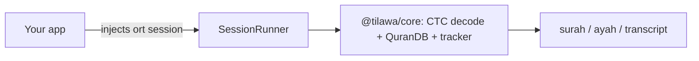

# Tilawa

> Formerly called offline-tarteel.

[](https://am.whhite.com/stats/yazinsai/tilawa)

Offline Quran recognition. Give it 16 kHz mono audio, get back `surah:ayah`. Fully on-device — web, mobile, or node, no network at inference time.

`@tilawa/core` is pure TypeScript with **zero native dependencies**. You inject an ONNX session behind a small `SessionRunner` interface, so the same package works everywhere by swapping which `onnxruntime` you wire in.



## Install

```bash
npm i @tilawa/core
# plus the onnxruntime for your platform (you own this dep):
npm i onnxruntime-web            # browser / WASM
npm i onnxruntime-node           # node
npm i onnxruntime-react-native   # React Native
```

Then download the model + text assets from [GitHub Releases](https://github.com/yazinsai/tilawa/releases/tag/v0.2.0):

```bash
base=https://github.com/yazinsai/tilawa/releases/download/v0.2.0

curl -L -O "$base/fastconformer_full_mixed.onnx"  # 88 MB — goes into your SessionRunner
curl -L -O "$base/vocab.json"                      # TilawaAssets.vocab
curl -L -O "$base/quran_ctc_tokens.json"           # TilawaAssets.quranCtcTokens
```

Plus `quran.json` (all 6,236 verses) from [`web/frontend/public/quran.json`](web/frontend/public/quran.json) → `TilawaAssets.quran`.

## Quickstart

The core never imports `onnxruntime` — you write a ~20-line `SessionRunner` that owns the `ort` dependency, then hand it to `createTilawaSession` along with the three JSON assets. Copy-paste adapters for each runtime live in [`packages/core/examples/`](packages/core/examples/).

### Web (onnxruntime-web / WASM)

```ts
import * as ort from "onnxruntime-web/wasm";
import { createTilawaSession, type SessionRunner } from "@tilawa/core";

async function createWebSessionRunner(modelBuffer: ArrayBuffer): Promise<SessionRunner> {
  ort.env.wasm.numThreads = 1; // single-threaded is the reliable default
  ort.env.wasm.simd = true;
  const session = await ort.InferenceSession.create(modelBuffer, {
    executionProviders: ["wasm"],
  });
  return {
    async run(audio) {
      const input = new ort.Tensor("float32", audio, [1, audio.length]);
      const length = new ort.Tensor("int64", BigInt64Array.from([BigInt(audio.length)]), [1]);
      const results = await session.run({ audio_signal: input, length });
      const output = results[session.outputNames[0]];
      const [, timeSteps, vocabSize] = output.dims as number[];
      return { logprobs: output.data as Float32Array, timeSteps, vocabSize };
    },
  };
}

const runner = await createWebSessionRunner(modelBuffer);
const session = createTilawaSession(runner, { vocab, quranCtcTokens, quran });

const pred = await session.transcribe(audioFloat32); // 16 kHz mono
// { surah: 1, ayah: 1, ayah_end: 3, score: 0.92, transcript: "..." }
```

### Node (onnxruntime-node)

```ts
import { readFile } from "node:fs/promises";
import * as ort from "onnxruntime-node";
import { createTilawaSession, type SessionRunner } from "@tilawa/core";

async function createNodeSessionRunner(modelBuffer: Uint8Array): Promise<SessionRunner> {
  const session = await ort.InferenceSession.create(modelBuffer);
  return {
    async run(audio) {
      const input = new ort.Tensor("float32", audio, [1, audio.length]);
      const length = new ort.Tensor("int64", BigInt64Array.from([BigInt(audio.length)]), [1]);
      const results = await session.run({ audio_signal: input, length });
      const output = results[session.outputNames[0]];
      const [, timeSteps, vocabSize] = output.dims as number[];
      return { logprobs: output.data as Float32Array, timeSteps, vocabSize };
    },
  };
}

const runner = await createNodeSessionRunner(await readFile("fastconformer_full_mixed.onnx"));
const session = createTilawaSession(runner, { vocab, quranCtcTokens, quran });
const pred = await session.transcribe(audioFloat32);
```

### React Native (onnxruntime-react-native)

RN can't hand the model to ORT as an `ArrayBuffer` — bundle the `.onnx` as an asset, copy it to the documents dir, and pass the **file path**.

```ts
import * as ort from "onnxruntime-react-native";
import { createTilawaSession, type SessionRunner } from "@tilawa/core";

async function createRNSessionRunner(modelPath: string): Promise<SessionRunner> {
  const session = await ort.InferenceSession.create(modelPath);
  return {
    async run(audio) {
      const input = new ort.Tensor("float32", audio, [1, audio.length]);
      const length = new ort.Tensor("int64", BigInt64Array.from([BigInt(audio.length)]), [1]);
      const results = await session.run({ audio_signal: input, length });
      const output = results[session.outputNames[0]];
      const [, timeSteps, vocabSize] = output.dims as number[];
      return { logprobs: output.data as Float32Array, timeSteps, vocabSize };
    },
  };
}

const runner = await createRNSessionRunner(modelPath);
const session = createTilawaSession(runner, { vocab, quranCtcTokens, quran });
const pred = await session.transcribe(audioFloat32);
```

## Streaming (live recitation)

For live recitation, feed audio chunks with `feed()`. The built-in tracker emits verse matches, candidates, and word-level progress as the reciter speaks. Subscribe via `onOutput`, or use the messages `feed()` returns.

```ts
const session = createTilawaSession(runner, assets, {
  config: "balanced", // or a Partial<StreamingConfig>
  onOutput: (msg) => {
    switch (msg.type) {
      case "verse_match":
        console.log(`${msg.surah}:${msg.ayah}`, msg.verse_text, msg.confidence);
        break;
      case "word_progress":
        console.log(`word ${msg.word_index}/${msg.total_words}`);
        break;
      case "final_sequence":
        console.log("done", msg.verses);
        break;
    }
  },
});

// push ~300ms Float32 chunks as they arrive from the mic
for await (const chunk of micChunks) await session.feed(chunk);

session.reset(); // start a new recitation
```

`onOutput` receives a `WorkerOutbound` union. The ones you care about:

| `msg.type` | Meaning | Key fields |
|---|---|---|
| `verse_match` | Confident match for the current verse | `surah`, `ayah`, `verse_text`, `surah_name`, `confidence`, `surrounding_verses` |
| `verse_candidate` | Ranked candidates before lock-in | `candidates[]`, `stable`, `final_flush` |
| `word_progress` | Word-level alignment within a verse | `surah`, `ayah`, `word_index`, `total_words`, `matched_indices` |
| `final_sequence` | Full ordered sequence when recitation ends | `verses[]`, `confidence` |

## API reference

```ts
createTilawaSession(runner: SessionRunner, assets: TilawaAssets, options?): TilawaSession
```

**`TilawaAssets`** — the JSON blobs you load (model bytes go into the runner, not here):

```ts
interface TilawaAssets {
  vocab: Record<string, string>;      // vocab.json (CTC token id -> string)
  quranCtcTokens: CtcTokenTable;       // quran_ctc_tokens.json
  quran: unknown[];                    // quran.json (6,236 verse records)
  blankId?: number;                    // defaults to 1024
}
```

**`SessionRunner`** — the seam you implement (see quickstarts):

```ts
interface SessionRunner {
  run(audio: Float32Array): Promise<{
    logprobs: Float32Array;
    timeSteps: number;
    vocabSize: number;
  }>;
}
```

**`TilawaSession`** — what you get back:

| Method | Purpose |
|---|---|
| `transcribe(audio)` | One-shot → `{ surah, ayah, ayah_end, score, transcript }` (0/0 on no match) |
| `transcribeRaw(audio)` | One-shot → full `TranscribeResult` (acoustic logprobs + champion match) |
| `feed(chunk)` | Streaming → `WorkerOutbound[]`, also fired via `onOutput` |
| `reset()` | Reset the streaming tracker for a new recitation |
| `setConfig(partial)` | Update streaming config live |
| `getConfig()` | Current effective `StreamingConfig` |
| `db` | Underlying `QuranDB` (verse lookup, search) |
| `decoder` | Underlying `TextCTCDecoder` |

**Streaming config** — pass a preset name or a `Partial<StreamingConfig>` via `options.config`:

- `"conservative"` — waits for strong evidence before locking a verse (fewer false matches)
- `"balanced"` — the default (`DEFAULT_STREAMING_CONFIG`)
- `"aggressiveAdvance"` — advances quickly, best for continuous recitation

The full `StreamingConfig` interface, the three presets (`CONSERVATIVE_STREAMING_CONFIG`, `BALANCED_STREAMING_CONFIG`, `AGGRESSIVE_ADVANCE_STREAMING_CONFIG`), and every exported type are re-exported from `@tilawa/core`.

## Model

| | Value |
|---|---|
| **Model** | Cyberistic's `c2c-direct-mixed-tta` (base: `nvidia/stt_ar_fastconformer_hybrid_large_pcd_v1.0`) |
| **File** | `fastconformer_full_mixed.onnx` — 88 MB, int4 MatMul + int8 Conv/LayerNorm |
| **Input** | 16 kHz mono audio, `Float32Array` (preprocessing baked into the graph) |
| **Output** | CTC logprobs over 1025-token Arabic BPE vocab, then CTC re-rank against Quran candidates |
| **Recall / Precision / SeqAcc** | 100% / 100% / 100% on the v1 53-sample benchmark (median of 3 runs) |
| **Latency** | 0.84s average on Apple Silicon CPU |
| **License** | [CC-BY-4.0](https://huggingface.co/nvidia/stt_ar_fastconformer_hybrid_large_pcd_v1.0) (NVIDIA model) |

## Live demo

[`web/frontend/`](web/frontend/) is a complete browser app that runs the SDK live — record and watch verses lock in in real time. It's also the regression guard for the SDK.

```bash
cd web/frontend && npm run dev
```

## Research & benchmarks

The model behind this SDK is the winner of a 20-approach bake-off (Whisper variants, pruned CTC, FastConformer sweeps, contrastive/embedding attempts). All of that — the Python benchmark harness, experiment code, training scripts, and per-approach writeups — lives under [`lab/`](lab/). Start with [`lab/EXPERIMENTS.md`](lab/EXPERIMENTS.md) and [`lab/AGENTS.md`](lab/AGENTS.md).
